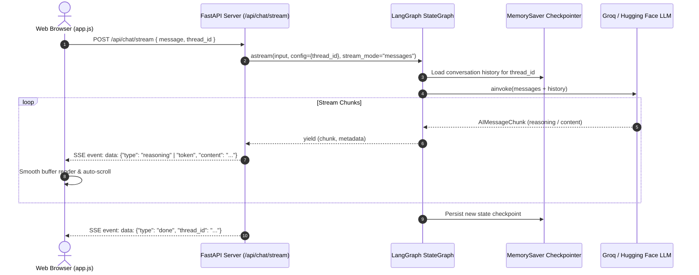

# Pure Conversation - LangGraph Chatbot 🤖✨

A minimalist, high-performance conversational AI application powered by **LangGraph**, **Groq** (with Hugging Face support), and **FastAPI**, featuring a frontend crafted directly from the Google Stitch **"Pure Conversation UI"** design system.

---

## 🌟 Features

- **🗂️ Collapsible Sidebar Navigation**: Sleek, responsive sidebar with a desktop toggle and mobile slide-over drawer with backdrop overlay.
- **➕ One-Click New Chat**: Instantly initialize fresh conversation threads with the "+ New Chat" button or the `Ctrl+N` (`Cmd+N`) shortcut.
- **💬 Recent Chats History**: Automatically saves conversations with titles derived from your initial prompt, displays active thread indicators, and allows one-click switching and individual chat deletion.
- **💾 Local Persistence & Memory Continuity**: Chat histories are preserved in browser `localStorage`, with each session maintaining its unique LangGraph `thread_id` so context is retained when jumping between chats.
- **🧠 Stateful LangGraph Architecture**: Built on a compiled `StateGraph` with in-memory checkpointing (`MemorySaver`) for multi-turn conversation memory and context retention across threads.
- **⚡ Real-Time SSE Token Streaming**: Streams tokens from LangGraph directly to the frontend using Server-Sent Events (SSE) via `/api/chat/stream`.
- **✨ Silky Smooth Typing Animation**: Frontend token queue with `requestAnimationFrame` ensures fluid, typewriter-like rendering without browser stutter or jumping.
- **💭 Live Thought Process UI**: Displays expandable live reasoning/thinking accordions for reasoning models (e.g. `openai/gpt-oss-120b`, DeepSeek-R1) before collapsing seamlessly into the final answer.
- **⏹️ Stop Generation**: Built-in `AbortController` allows users to pause or cancel response generation mid-stream.
- **📜 Smart Auto-Scroll**: High-performance scrolling keeps up with incoming tokens while automatically pausing if you scroll up to read earlier messages.
- **🎨 Premium Stitch Aesthetics**: Clean typography, warm color palette, code syntax styling, and glowing streaming cursors.

---

## ⌨️ Keyboard Shortcuts

| Shortcut | Action |
|---|---|
| `Ctrl + N` / `Cmd + N` | Start a **New Chat** |
| `Enter` | **Send** message |
| `Shift + Enter` | Insert a **new line** in the message input |
| `Esc` | Close mobile sidebar |

---

## 🏗️ Architecture



---

## 📁 Project Structure

```text
Simple-Chatbot/
├── .env.example            # Environment variables template (Groq & Hugging Face)
├── .gitignore              # Git ignore rules for virtualenv & secrets
├── README.md               # Project documentation
├── requirements.txt        # Python package dependencies
├── langgraph_backend.py    # LangGraph StateGraph, MemorySaver & LLM configuration
├── server.py               # FastAPI server and streaming SSE endpoints
└── static/
    ├── index.html          # Stitch "Pure Conversation" layout with responsive sidebar
    ├── style.css           # Sidebar transitions, micro-animations & custom scrollbars
    └── app.js              # Multi-session state, streaming SSE consumer & UI logic
```

---

## 🚀 Getting Started

### 1. Prerequisites
- **Python 3.10+**
- An API Key:
  - **Groq API Key (Recommended)**: Get a free key from [console.groq.com/keys](https://console.groq.com/keys).
  - *or* **Hugging Face Token**: Get one at [huggingface.co/settings/tokens](https://huggingface.co/settings/tokens).

### 2. Clone the Repository
```bash
git clone https://github.com/your-username/Simple-Chatbot.git
cd Simple-Chatbot
```

### 3. Create & Activate Virtual Environment
- **Windows (PowerShell)**:
  ```powershell
  python -m venv venv
  .\venv\Scripts\Activate.ps1
  ```
- **macOS / Linux**:
  ```bash
  python3 -m venv venv
  source venv/bin/activate
  ```

### 4. Install Dependencies
```bash
pip install -r requirements.txt
```

### 5. Configure Environment Variables
Create a `.env` file in the root directory (or copy from `.env.example`):
```bash
cp .env.example .env
```

Add your API key inside `.env`:
```env
# Groq (Recommended)
GROQ_API_KEY=gsk_your_groq_api_key_here

# Hugging Face (Optional alternative)
HUGGINGFACEHUB_API_TOKEN=hf_your_token_here
```

### 6. Run the Application
Start the FastAPI server with Uvicorn:
```bash
python -m uvicorn server:app --host 127.0.0.1 --port 8000 --reload
```

Open your browser and navigate to:
👉 **[http://127.0.0.1:8000](http://127.0.0.1:8000)**

---

## 🛠️ Model Configuration

You can customize the model and settings inside [`langgraph_backend.py`](langgraph_backend.py):

### 1. Instant Streaming (Fast Chat)
For immediate word-by-word streaming with zero delay:
```python
llm = ChatGroq(
    model="qwen/qwen3.8-27b",  # or "qwen/qwen3.6-27b"
    temperature=0.7,
    streaming=True
)
```

### 2. Reasoning Models (Deep Thought Process)
To stream the model's internal thinking process in a collapsible "Thinking..." block before receiving the answer:
```python
llm = ChatGroq(
    model="openai/gpt-oss-120b",
    temperature=0.7,
    streaming=True
)
```

### 3. Hugging Face Inference
To use Hugging Face instead, uncomment the `HuggingFaceEndpoint` configuration:
```python
llm = HuggingFaceEndpoint(
    repo_id="meta-llama/Llama-3.1-8B-Instruct",
    task="text-generation",
    max_new_tokens=512,
    huggingfacehub_api_token=os.getenv("HUGGINGFACEHUB_API_TOKEN"),
)
```

---

## 📡 API Endpoints

| Method | Endpoint | Description |
|---|---|---|
| `POST` | `/api/chat/stream` | Real-time Server-Sent Events (SSE) streaming endpoint |
| `POST` | `/api/chat` | Synchronous / non-streaming JSON response endpoint |
| `GET` | `/api/status` | Health check verifying LangGraph backend compilation status |
| `GET` | `/` | Serves the Pure Conversation web application |
