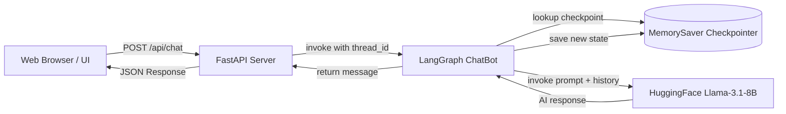

# Pure Conversation - LangGraph Chatbot 🤖✨

A minimalist, modern conversational AI application powered by **LangGraph**, **Hugging Face (Llama 3.1-8B-Instruct)**, and **FastAPI**, with a frontend designed directly from the Google Stitch **"Pure Conversation UI"** design system.

---

## 🌟 Features

- **🧠 Stateful LangGraph Architecture**: Built on a compiled `StateGraph` with in-memory checkpointing (`MemorySaver`) for multi-turn conversation memory and context retention.
- **⚡ High-Performance FastAPI Backend**: Serves static UI assets and exposes asynchronous `/api/chat` and `/api/status` endpoints.

---

## 🏗️ Architecture



---

## 📁 Project Structure

```text
Simple-Chatbot/
├── .env.example            # Environment variables template
├── .gitignore              # Git ignore rules for virtualenv & secrets
├── README.md               # Project documentation
├── requirements.txt        # Python package dependencies
├── langgraph_backend.py    # LangGraph StateGraph, MemorySaver & Hugging Face LLM
├── server.py               # FastAPI server and chat API endpoint
└── static/
    ├── index.html          # Stitch "Pure Conversation" HTML template
    ├── style.css           # Tailwind configuration & micro-animations
    └── app.js              # Client-side chat logic & thread management
```

---

## 🚀 Getting Started

### 1. Prerequisites
- **Python 3.10+**
- A **Hugging Face API Token** (Access to `meta-llama/Llama-3.1-8B-Instruct` or your preferred model). Get one at [huggingface.co/settings/tokens](https://huggingface.co/settings/tokens).

### 2. Clone the Repository
```bash
git clone https://github.com/your-username/Simple-Chatbot.git
cd Simple-Chatbot
```

### 3. Create & Activate Virtual Environment
- **Windows (PowerShell)**:
  ```powershell
  python -m venv venv
  .\venv\Scripts\Activate.ps1
  ```
- **macOS / Linux**:
  ```bash
  python3 -m venv venv
  source venv/bin/activate
  ```

### 4. Install Dependencies
```bash
pip install -r requirements.txt
```

### 5. Configure Environment Variables
Create a `.env` file in the root directory (or copy from `.env.example`):
```bash
cp .env.example .env
```

Add your Hugging Face API key inside `.env`:
```env
HUGGINGFACEHUB_API_TOKEN=hf_your_actual_token_here
```

### 6. Run the Application
Start the FastAPI server using Uvicorn:
```bash
python -m uvicorn server:app --host 127.0.0.1 --port 8000 --reload
```

Open your browser and navigate to:
👉 **[http://127.0.0.1:8000](http://127.0.0.1:8000)**

---

## 🛠️ Customization

### Changing the LLM Model
You can change the underlying model in [`langgraph_backend.py`](langgraph_backend.py):
```python
llm = HuggingFaceEndpoint(
    repo_id="meta-llama/Llama-3.1-8B-Instruct",  # Change to any Hugging Face repo
    task="text-generation",
    max_new_tokens=512,
    do_sample=False,
    huggingfacehub_api_token=hf_token,
)
```

### Adding LangGraph Nodes & Tools
To add tool-calling or multi-step reasoning, modify the `StateGraph` definition in [`langgraph_backend.py`](langgraph_backend.py):
```python
# Add your custom nodes
graph.add_node("chat_node", chat_node)
# Add conditional edges or tool execution nodes
graph.add_edge(START, "chat_node")
graph.add_edge("chat_node", END)
```
